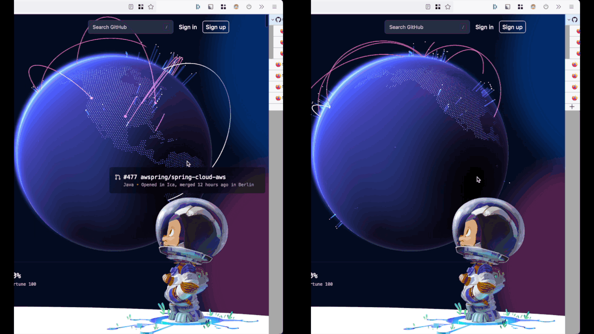

# Tree Style Tabs - Hover Hide/Show
Automatically show/hide [Firefox's Tree Style Tabs Extention](https://github.com/piroor/treestyletab) expanding over the main content.
This is unlike the [suggested auto hide/show hover](https://github.com/piroor/treestyletab/wiki/Code-snippets-for-custom-style-rules#auto-showhide-sidebar-by-mouseover-hover) which changes the width of the main content to make space. 

## Example

The [suggested hover hide](https://github.com/piroor/treestyletab/wiki/Code-snippets-for-custom-style-rules#auto-showhide-sidebar-by-mouseover-hover) is pictured on the left. The changes in [hoverhide.css](hoverhide.css) are on the right.[^1]  

[^1]: Also pictured: [link](https://github.com/piroor/treestyletab/wiki/Code-snippets-for-custom-style-rules#for-only-tree-style-tab-sidebar-1397)

## Install
Copy the contents of [hoverhide.css](hoverhide.css) to your Firefox profiles userChrome.css file.
